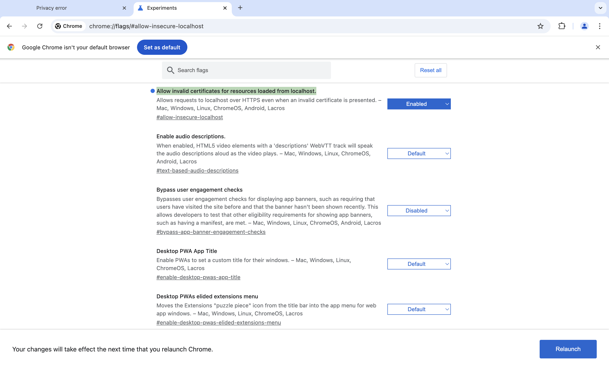

# Steps for Installing Project and Running
#### Set up Project 
- Install MongoDB using the following link:

https://docs.mongodb.com/manual/tutorial/install-mongodb-on-windows

- Git Clone the Repository

  `git clone https://github.com/VibhavDeo/FitnessApp.git`
  

- Install the required packages by running the following command in the terminal

  `pip install -r requirements.txt`


- Create a `.env` file in the root folder and paste the content as found in `.env.example`. Populate the fields with your own credentials
  
- Run the following command in the terminal
  `pip install -r requirements.txt`


- Create a `.env` file in the root folder and paste the content as found in `.env.example`. Populate the fields with your own credentials
#### Create Google Client Credentials
- First, note that you will need a Google Account. You already have one if you use Gmail.

- Go to the [Google developers credentials page](https://console.developers.google.com/apis/credentials).

- Once in, you may be prompted to agree to their terms of service. Should you agree to those, press the Create credentials button on the next page. Select the option for OAuth client ID:

- Select the Web application option at the top. You can provide a name for the client in the Name field as well. The name you provide will be displayed to users when they are consenting to your application acting on their behalf.

- if you’ll be running your web application locally for now, so you can set the Authorized JavaScript origins to https://127.0.0.1:5000 and Authorized redirect URIs to https://127.0.0.1:5000/login/callback. This will allow your local Flask application to communicate with Google.

- Finally, hit Create and take note of the client ID and client secret. You’ll need both later. You may also download the config file as json and update you `.env` file with the required fields
  #### Start the application
- Run the following command in the terminal

  ```
  export FLASK_APP=fitnessapp && export FLASK_ENV=development && FLASK_DEBUG=1 && flask run
  ```
- Open the URL in your browser:  ` http://127.0.0.1:5000/`

- For Google Sign In to work, run the app on `https` using the command below:
```
export FLASK_APP=fitnessapp && export FLASK_ENV=development && FLASK_DEBUG=1 && flask run --cert=adhoc

```  

#### GOOGLE CHROME SETTINGS FOR SSL
for ssl to work locally on google chrome, you will have to do the following settings within your chrome browser.
- open this URL on chrome chrome://flags/#allow-insecure-localhost
- set the Allow invalid certificates for resources loaded from localhost. and enable this by clicking on relaunch at the bottom right. see image below

- note that this settings is not required for firefox 
  


#### Backgroun Tasks
- Make sure you have RabitMQ installed and running on your system
- Run the following command to start celery worker and beat for email-reminders

  ```
  celery -A make_celery worker -B --loglevel=info
  ```   
- Note that for email reminders to work, make sure you have created an events in your database and their date is equalt to date of current date. 

NOTE!!:
Make sure you have redis install on your local machine for background tasks with celery to work. see https://redis.io/docs/latest/operate/oss_and_stack/install/

If you get error regarding any of the following packages - pymongo and bson, then dont worry we have also been there. Run the following commands to resolve the error :


```
    pip uninstall bson
    pip uninstall pymongo
    pip install pymongo
```